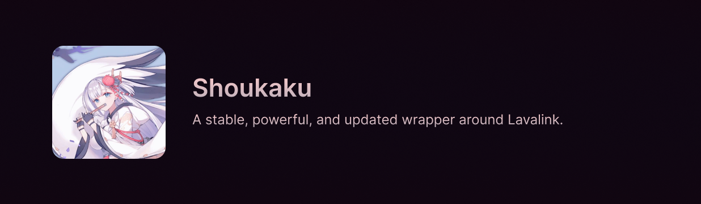

>  *The melody of my flute is a requiem for the dead. Shall I play it for you?*

## Overview

This is a fork of the [original](https://github.com/shipgirlproject/Shoukaku) with an attempt to make it solely compatible with [Bun](https://bun.sh/) and [Discord.js](https://discord.js.org/). This is not intended for public use and is only for personal use. Although, you are free to use it if you wish.

Refer to the original repository for more information.

## License

This project is a fork licensed under the [MIT License](LICENSE) originally made by [@Deivuu](https://github.com/Deivu). Please refer to the license for more information.